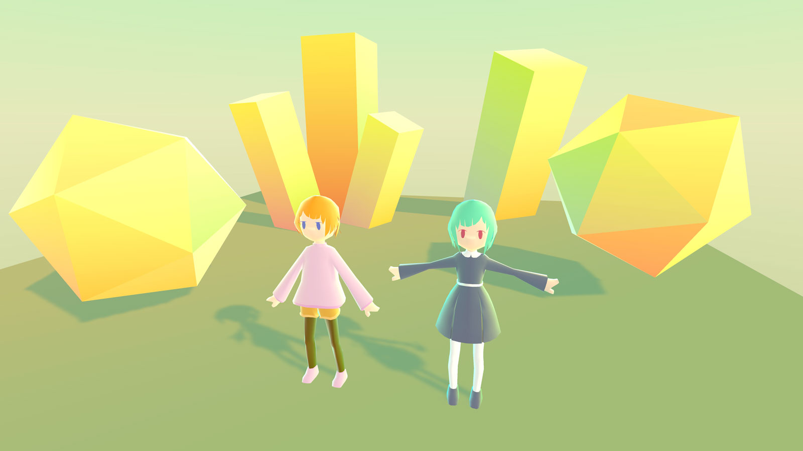

# Alto-tascal-Unity-Lib

## あると助かる Unity ライブラリ

Alto-tascal-Unity-Lib … 通称 `Alto` （アルト）は、

> 無かったら無かったで何とかするけど、まあ、あると… 助かる

といった温度感のコードをまとめた Unity 向けフレームワーク / ユーティリティ / シェーダ集です。

____

- [Tatsuya Koyama](https://twitter.com/tatsuya_koyama) が趣味のゲーム開発をする際に書いたコードをまとめたものです
- 趣味のコードでありサポートなどはできませんが、サイトで実装を紹介する際のリファレンスコード的に置いておきます

- URP 7.3.1 で動作するカラフルシェーダなどが入っています
- あとはシーン遷移の管理やメッセージング、簡易トゥイーンを扱うちょっとしたフレームワーク（書きかけ）など
  - 趣味開発でのニーズに応じてちょっとずつ足されていく見込み

## 動作環境

- Unity 2019.4.1f1 (LTS)

開発は macOS Mojave 10.14.5 で行っています。

## 依存パッケージ

- [UniTask](https://github.com/Cysharp/UniTask) 2.0.31
- Addressables 1.8.4
- Universal RP 7.3.1

## 作者サイト

- [Alto-tascal](https://tatsuya-koyama.com/)

たまに解説記事など書くかもしれません。
