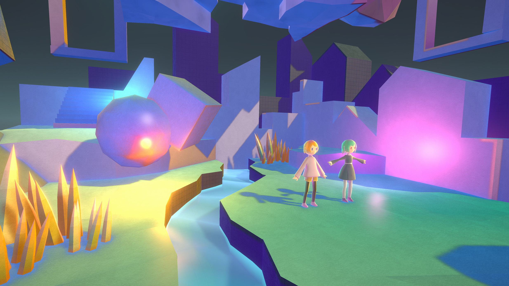
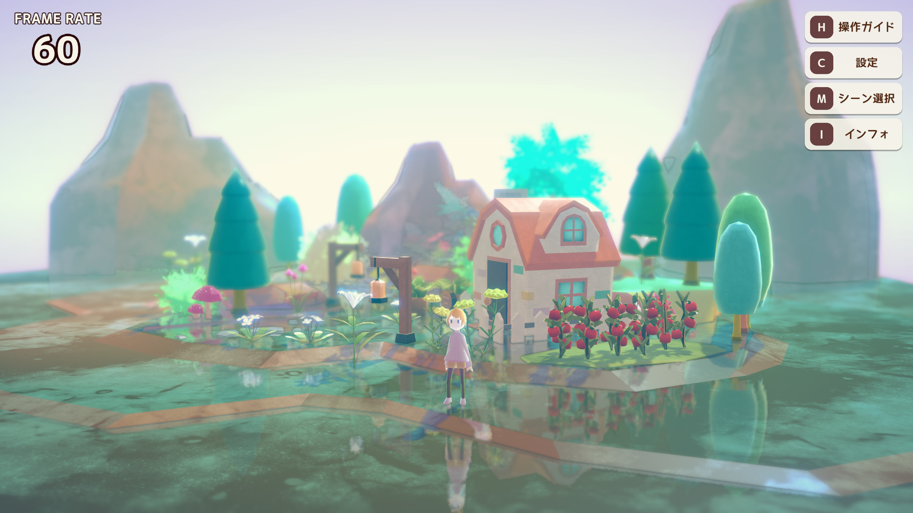
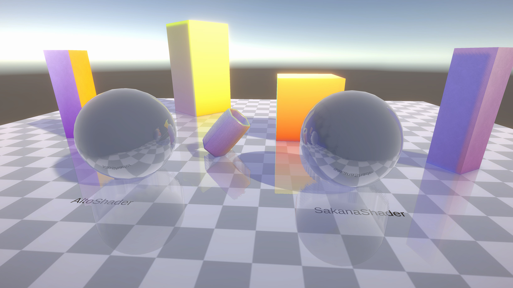

# Alto-tascal-Unity-Lib

## あると助かる Unity ライブラリ

Alto-tascal-Unity-Lib … 通称 `Alto` （アルト）は、

> 無かったら無かったで何とかするけど、まあ、あると助かる

といった温度感のコードをまとめた Unity 向けフレームワーク / ユーティリティ / シェーダ集です。

____

- [Tatsuya Koyama](https://twitter.com/tatsuya_koyama) が趣味のゲーム開発をする際に書いているコードをまとめたものです
- 趣味のコードであり込み入った解説やサポートなどはできませんが、誰かに実装を紹介する際のリファレンスコード的な位置づけで公開状態にしています

## どんな内容？

### AltoFramework

ゲーム開発をする際にどんなゲームでもまあ大体こういうことをやるよね、といった処理をまとめたフレームワークです。以下のようなことを担います：

- シーンスコープの管理（リソース管理や初期化のハンドラ）
- オーディオ制御
- 手軽に書けるメッセージング機構（Signal）
- 手軽に書ける Tween
- 汎用オブジェクトプール
- デバッグログ

### AltoLib

単体で持っていって使えるゲーム開発向けのライブラリ集です：

- ユーザデータ向けのストレージの読み書き
- CSV からマスタデータを読む機構
- FSM（Finite State Machine）
- Unity 開発向けコンポーネントやクラス拡張

など。

### AltoEditor

Unity ゲーム開発を少し快適にする開発ツール系エディタ拡張です。

【紹介記事】（2025-09）：

- [【Alto-Editor】 人間が Unity でゲーム開発するときにあると嬉しいエディタ拡張たち | Alto-tascal](https://tatsuya-koyama.com/docs/alto-editor/editor-extensions/)

【紹介動画】 https://youtu.be/f8QdH8oUT7I

### AltoShader

- URP 17 系（Unity 6）で動作する自作のシェーダ群です

【デモ動画】（2023-02） https://youtu.be/GimRchE1N68

- 作者が普段制作しているゲームや技術デモでは、このリポジトリにあるシェーダで絵作りをしています。

【利用イメージ】

- URP（RenderGraph 系）で動作する Screen Space Reflections の Renderer Feature などもあります：

## 動作確認環境

- Unity 6000.3.11f1

開発は macOS Sonoma 14.5 で行っています。

## 依存パッケージ

- [UniTask](https://github.com/Cysharp/UniTask) 2.4.1
- Addressables 2.6.0
- Universal RP 17.3.0

## 作者サイト

- [Alto-tascal](https://tatsuya-koyama.com/)
